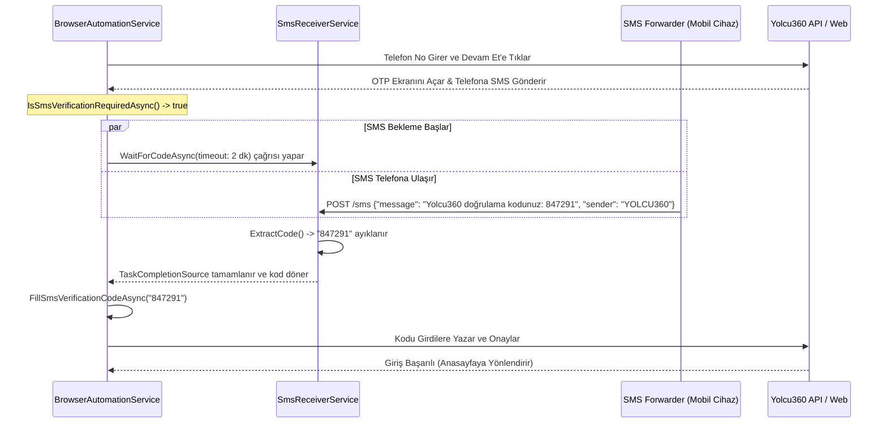

# Yolcu360 Otomasyonu: Servis Dokümantasyonu

Bu doküman, Yolcu360 araç kiralama otomasyon projesinde kullanılan iki temel servis olan **BrowserAutomationService** ve **SmsReceiverService** sınıflarının çalışma prensiplerini, iç yapısını, metotlarını ve bu iki servisin OTP (tek kullanımlık şifre) sürecinde nasıl entegre çalıştığını detaylandırmaktadır.

---

## 1. SmsReceiverService

[SmsReceiverService.cs](file:///Users/erayoz/Codes/Staj/Yolcu360Otomasyon/Services/SmsReceiverService.cs) sınıfı, otomasyon sırasında Yolcu360 sisteminin SMS ile gönderdiği OTP (Tek Kullanımlık Şifre) doğrulama kodlarını yakalamak için geliştirilmiş, **kendi kendine barındırılan (self-hosted) yerel bir HTTP API sunucusudur**.

Telefonlara yüklenen bir SMS Yönlendirici (SMS Forwarder) uygulaması veya harici bir sistem aracılığıyla gelen SMS'leri HTTP istekleri olarak bu servise yönlendirir.

### A. Temel Özellikler
- **HttpListener Temelli Sunucu**: Harici bir web sunucusuna (IIS, Kestrel vb.) ihtiyaç duymadan doğrudan C# üzerinden hafif bir HTTP dinleyicisi başlatır.
- **Dinamik Port Arama**: Varsayılan port (5000) başka bir uygulama tarafından kullanılıyorsa, otomatik olarak sonraki portları (`5001`, `5002` vb.) dener (Maksimum 20 deneme).
- **Eşzamansız Bekleme (`TaskCompletionSource`):** SMS kodunun gelmesini bekleyen asenkron görevleri bloke etmeden yönetir. Aynı anda birden fazla bekleyiciyi (`_waiters`) destekler.
- **Regex ile OTP Ayıklama**: Gelen SMS içeriğinden 4 ila 8 haneli sayısal şifreleri (`\b\d{4,8}\b`) otomatik olarak ayıklar.
- **Çoklu Veri Formatı Desteği**: Gelen HTTP isteklerini `Query String`, `JSON` (`SmsPayload` modeli) veya `x-www-form-urlencoded` formatlarında okuyabilir.

### B. Önemli Sınıf Alanları (Fields)
```csharp
private static readonly Regex OtpRegex = new(@"\b\d{4,8}\b", RegexOptions.Compiled);
private readonly List<TaskCompletionSource<string>> _waiters = [];
private HttpListener? _listener;
private CancellationTokenSource? _cts;
private Task? _listenerTask;
private string? _latestCode;
```

### C. Metot Detayları

#### 1. `StartAsync()`
Belirtilen porttan itibaren (`_preferredPort`) HTTP dinleyicisini başlatır. Port meşgulse hata fırlatmak yerine port numarasını 1 artırarak tekrar dener. Başarılı şekilde bağlanıldığında `ListenLoopAsync` metodunu arka plan görevi (`Task.Run`) olarak başlatır.

#### 2. `WaitForCodeAsync(TimeSpan timeout, CancellationToken cancellationToken)`
Otomasyon akışının SMS kodunu beklemesini sağlayan kritik metottur.
- Eğer daha önce alınmış bir kod (`_latestCode`) varsa doğrudan onu döner.
- Yoksa, yeni bir `TaskCompletionSource<string>` oluşturarak `_waiters` listesine ekler ve belirtilen zaman aşımı (`timeout`) süresince asenkron olarak bekler. Zaman aşımı veya iptal durumunda beklemeyi sonlandırır.

#### 3. `ListenLoopAsync(CancellationToken cancellationToken)`
HTTP dinleyicisinin ana döngüsüdür. İstek geldikçe `HandleContextAsync` metodunu her istek için yeni bir asenkron görev olarak çalıştırır; böylece ana döngünün kilitlenmesini önler.

#### 4. `HandleContextAsync(HttpListenerContext context)`
Gelen HTTP isteğinin geçerliliğini ve içeriğini kontrol eder.
- İstek adresinin yalnızca `/sms` olmasını şart koşar (büyük/küçük harf duyarsız).
- `ReadIncomingMessageAsync` ile mesaj metnini ve gönderici bilgisini okur.
- `ExtractCode` ile mesajdan OTP kodunu ayıklar.
- Kod başarıyla çıkarılmışsa, bekleyen tüm `_waiters` nesnelerini `TrySetResult(code)` ile tamamlar ve `SmsReceived` olayını tetikler.
- İstemciye `200 OK` ve JSON formatında durum bilgisi döner.

#### 5. `ReadIncomingMessageAsync(HttpListenerRequest request)`
İsteğin taşıma yöntemine göre SMS mesajını ve göndereni çözümler:
- **Query / URL Parametreleri**: URL sonundaki `?sender=...&message=...` veya `?sms_message=...` parametrelerini okur.
- **URL Path Fallback**: Eğer URL `/sms/mesaj_icerigi` biçimindeyse mesajı path üzerinden alır.
- **JSON Body**: Content-Type `application/json` ise gövdeyi `SmsPayload` nesnesine deserialize eder.
- **Form Body**: Content-Type `application/x-www-form-urlencoded` ise form verilerini çözümler.
- **Plain Text**: Hiçbiri değilse doğrudan gelen ham metni mesaj olarak kabul eder.

---

## 2. BrowserAutomationService

[BrowserAutomationService.cs](file:///Users/erayoz/Codes/Staj/Yolcu360Otomasyon/Services/BrowserAutomationService.cs) sınıfı, **PuppeteerSharp** kütüphanesini kullanarak Yolcu360 web sitesi üzerindeki tüm kullanıcı adımlarını simüle eden **tarayıcı otomasyon servisidir**.

### A. Temel Özellikler
- **Headless Tarayıcı Yönetimi**: Tarayıcıyı arka planda (headless) veya görünür (headful) modda çalıştırabilir.
- **Vue / Nuxt Uyumlu DOM İşlemleri**: Yolcu360 altyapısında kullanılan Vue/Nuxt framework'ünün getirdiği dinamik render ve state hydration mekanizmaları ile uyumlu çalışır. Sıradan Puppeteer metotlarının tetikleyemediği Vue event'lerini (`input`, `change`, `keyup` vb.) native JS kodları enjekte ederek tetikler.
- **Canlı Debug Arayüzü**: Sayfanın sol üst köşesine dinamik bir `#_y360_debug` div paneli yerleştirerek otomasyonun anlık durumunu tarayıcı ekranında gösterir.
- **Tıklama ve Giriş Korumaları**: Yolcu360'ın autocomplete seçimi sırasında sayfayı yenilemesini engellemek için geçici JS form submit guard'ları kurar.

### B. Seçici Sabitleri (`Selectors`)
Yolcu360 web sitesinin HTML yapısındaki değişikliklerden etkilenmemek veya değiştiğinde tek bir yerden güncelleyebilmek için selector'lar bir iç sınıfta toplanmıştır:
- Giriş Sayfası: `#phn-input` (telefon girdisi).
- Arama Formu: `#inputPickUpLocation` (Alış yeri girdisi), `.dp__main.dp__theme_light` (tarih seçiciler).
- Arama Butonu: `#search`.
- Filtreler: Otomatik/Manuel şanzıman ve Dizel/Benzin yakıt türlerine ait butonlar (örn. `[data-filter='automatic']`).

### C. Önemli Akışlar ve Metotlar

#### 1. Başlatma (`InitializeAsync`)
`BrowserFetcher` kullanarak Chromium tarayıcı sürümünü kontrol eder/indirir. Ardından `--no-sandbox` gibi parametrelerle tarayıcıyı başlatır ve ekran çözünürlüğünü `1440x900` olarak ayarlar.

#### 2. Telefon ile Giriş Yapma (`LoginWithPhoneAsync` & `FillSmsVerificationCodeAsync`)
- `/login` sayfasına gider ve ilk açılan indirim/kampanya popup'larını (`CloseInitialPopupAsync`) temizler.
- `NativeSetInputAsync` aracılığıyla telefon numarasını yazar ve "Devam Et" butonunu JS seviyesinde bularak tıklar.
- Giriş sonrası SMS doğrulama gerekip gerekmediğini `IsSmsVerificationRequiredAsync` ile test eder.
- Eğer SMS ekranı geldiyse, tek haneli 6 adet input kutusu (OTP maskesi) veya tek bir OTP girdisi olmasına göre dinamik bir JS kod bloğu ile doğrulama kodunu yazar ve doğrula butonuna tıklar.

#### 3. Arama Formunu Doldurma (`ApplySearchFiltersAndSearchAsync`)
Bu metot tüm arama sürecini sırayla yürütür:
1. **Hydration Isınması**: Sayfanın tamamen etkileşimli hale gelmesi (Nuxt Hydration) için fareyi hareket ettirir ve tıklar.
2. **Alış Yeri Seçimi (`FillPickupLocationAsync`)**:
   - Girdi kutusuna odaklanır ve temizler.
   - Yazma sırasında sayfanın yenilenmesini engelleyen `keydown` ve `submit` guard'larını kurar.
   - Kelimeyi yazdıktan sonra autocomplete (`.search-autocomplete`) önerilerinin açılmasını bekler.
   - Öneriler arasından girilen metne en uygun olanını (tam eşleşme, ile başlayan, içeren puanlamasıyla) seçer, koordinatlarını hesaplar ve fareyi oraya götürüp tıklatır.
3. **Tarih Aralığı Seçimi (`SelectDateRangeAsync`)**:
   - Yolcu360'ın kullandığı **VueDatePicker** bileşeni iki tarihi tek bir range picker içinde tutar. Bu yüzden takvimi bir kere açıp ardışık iki tıklama yapılması gerekir.
   - Alış Tarihi alanına tıklayarak takvimi açar.
   - `NavigateToMonthAsync` ile hedef aya gitmek için ileri/geri ok tuşlarını simüle eder.
   - İlk tarihi seçer (takvim açık kalır). Bırakış tarihi farklı bir aydaysa tekrar navigasyon yapar ve ikinci tarihi seçer (takvim kapanır).
4. **Saat Seçimi (`SelectTimeAsync`)**:
   - Alış ve bırakış saat kutularına (`timePickerIndex: 0` ve `1`) tıklar.
   - Açılan dropdown listesindeki seçenekleri (`.dropdown-item`) tarayarak hedef saate tıklar.
5. **Filtreler ve Arama**:
   - Seçilen vites (`TransmissionType`) ve yakıt (`FuelType`) filtrelerine tıklar.
   - `#search` butonuna odaklanır. Fare tıklaması işe yaramazsa pointer, mouse ve click olay zincirlerini JS üzerinden enjekte ederek tetikler.
   - Arama sonuç sayfasına yönlenildiğini doğrular.

#### 4. Sonuçları Okuma (`ReadSearchResultsAsync`)
Arama sonuçları sayfasındaki `#car_card_list .car-card` elemanlarının yüklenmesini bekler. Yüklendiğinde sayfa üzerinde JS değerlendirmesi (`EvaluateFunctionAsync`) çalıştırarak her bir araç kartından şu bilgileri nesne olarak toplar:
- Araç Adı (Title) ve benzeri bilgisi (Subtitle)
- Toplam ve Günlük Kiralama Fiyatı
- Şanzıman Tipi (Manuel/Otomatik)
- Yakıt Türü (Benzin/Dizel/Hibrit/Elektrik)
- Tedarikçi/Kiralama Şirketi (Supplier)
- Alış/Teslim Bilgisi (PickupInfo)
- Kiralama Detay URL'i

---

## 3. İki Servisin Entegrasyon Mimarisi

Otomasyonun en kritik noktası, giriş yaparken ihtiyaç duyulan **SMS doğrulama kodunun (OTP) tamamen el değmeden girilebilmesidir**. Bu süreç iki servisin işbirliğiyle şu şekilde gerçekleşir:



### Akış Aşamaları:
1. **İlişkilendirme**: Otomasyon başlatıldığında `SmsReceiverService` yerel bir portta dinlemeye başlar.
2. **Bekleme Durumu**: `BrowserAutomationService` giriş formunu gönderdikten sonra doğrulama ekranının açıldığını saptar ve `SmsReceiverService.WaitForCodeAsync` metodunu çağırarak beklemeye koyulur.
3. **Kodun Yakalanması**: Kullanıcının telefonuna gelen SMS, telefondaki bir yönlendirici uygulama vasıtasıyla bilgisayarın yerel IP'sine ve `SmsReceiverService` portuna (`http://<ip>:<port>/sms`) gönderilir.
4. **Çözümleme**: `SmsReceiverService` isteği yakalar, regex ile mesaj gövdesinden şifreyi (örneğin `847291`) ayıklar.
5. **Giriş ve Onay**: Kod çözüldüğü an askıda bekleyen `WaitForCodeAsync` görevi çözülür. `BrowserAutomationService` kodu alır, formdaki ilgili alanları otomatik doldurur ve girişi tamamlar.
